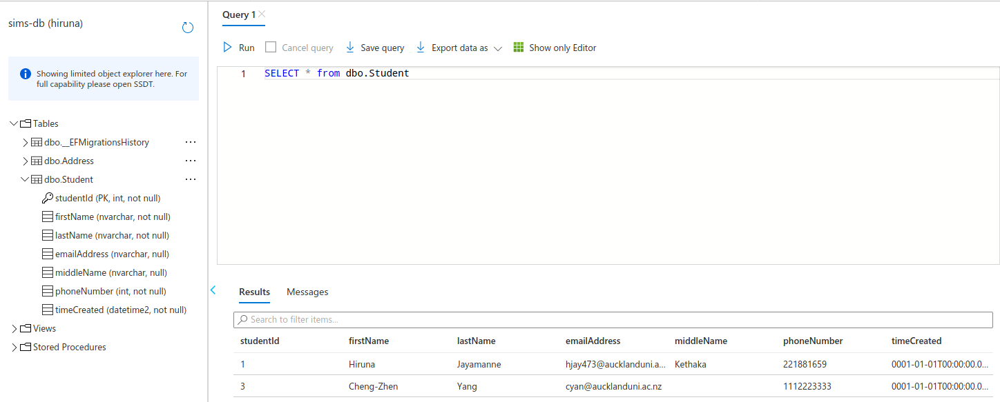
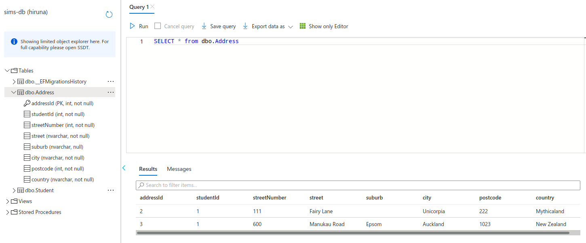
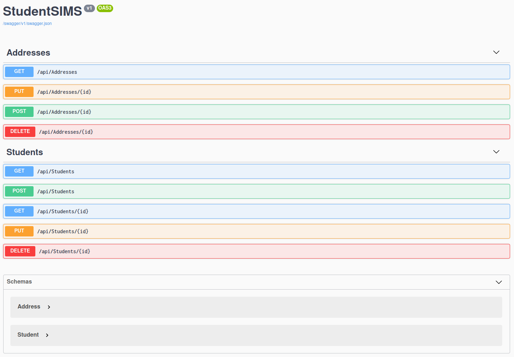

# MSA Phase 1 Backend

This is my Microsoft Student Accelerator's Phase 1 Backend submission.

[Hosted here.](https://backend-msa-2020.azurewebsites.net/)

## Explanation of Address routes

The requirement was that the routes to add and modify addresses used the student id.
However there is a one student to many addresses relationship which may require a unique address id
which would make the student id redundant.
Therefore I made it so that only the first address of the student would change.
I know this isn't as useful but it was done to fit within the constraints of having to use the student id.

## Screenshots

### Student Table

### Address Table

### Swagger UI

